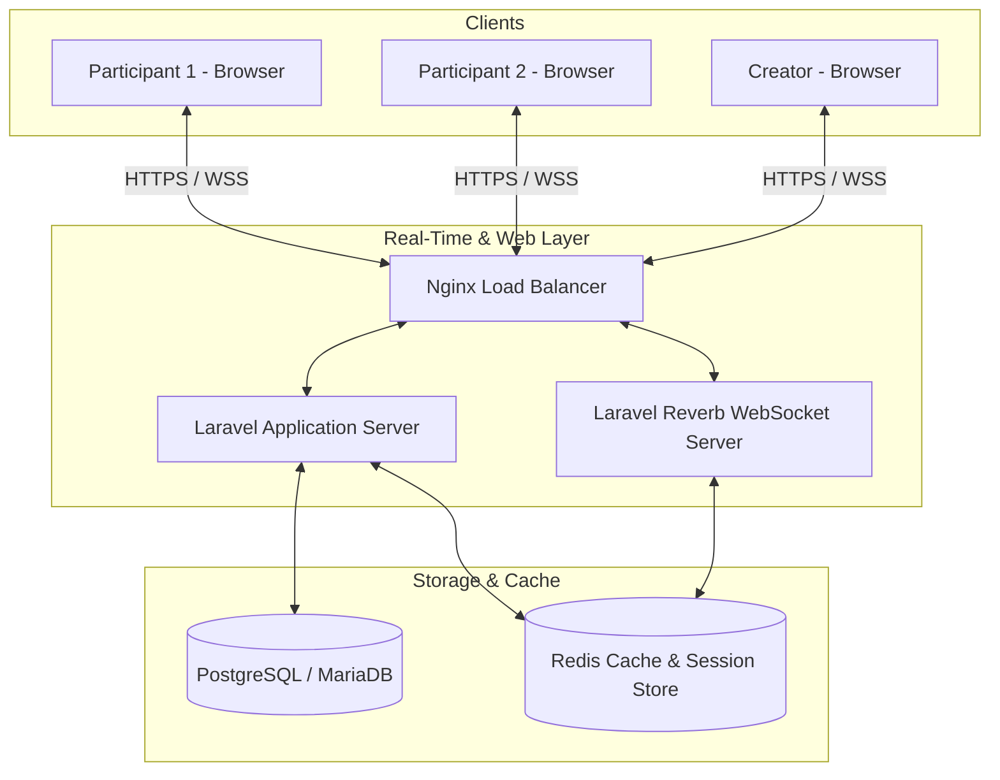
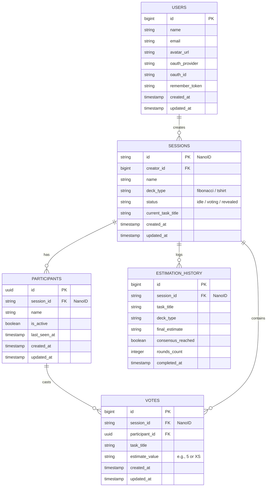
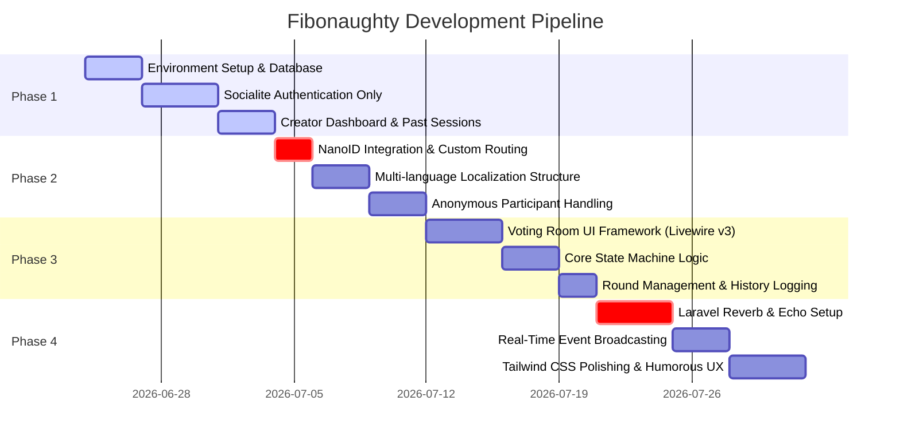

# Fibonaughty: Technical Blueprint & Architectural Plan

This document outlines the complete architectural plan, database schema, real-time synchronization strategy, and step-by-step implementation roadmap for **Fibonaughty**, a collaborative, web-based Planning Poker application built with PHP 8.x and Laravel.

---

## 1. Naming & Branding Ideation

### Brand Concept
**Fibonaughty** is a gamified, consensus-based agile estimation tool designed to bring transparency, speed, and a healthy dose of lighthearted developer-centric humor to the estimation process. 

The name itself is a playful blend of *Fibonacci* and *Naughty*, hinting that estimating software is a messy, sometimes "rebellious" activity where actual requirements often clash with project manager fantasies.

### Technical Humor & Microcopy Integration
To keep development teams engaged, the user interface will be laden with witty microcopy reflecting the daily realities of modern software engineering (such as scope creep, caffeine addiction, legacy code dread, and git merge conflicts).

#### A. Loading Screens & Transitions
- *"Compiling consensus... Please wait while we resolve your team's optimism conflicts."*
- *"Blaming the intern for local network latency..."*
- *"Calculating the ratio of story points to remaining developer sanity..."*
- *"Brewing virtual espresso to counter incoming scope creep..."*
- *"Refactoring the estimation engine to bypass PM expectations..."*

#### B. Error States & Warnings
- **418 I'm a Teapot:** *"Your estimate is too high for this backlog. Please lower your expectations or replenish your coffee supply."*
- **Scope Creep Overflow:** *"Estimate exceeds 100 story points. This is no longer a task; it's a lifestyle choice. Contact your system architect or therapist."*
- **Consensus Timeout:** *"Consensus not reached. Standard procedure dictates a trial-by-combat or blaming the database administrator."*
- **Invalid Participant:** *"Who goes there? We couldn't verify your identity. Did your local cookie self-destruct?"*

#### C. Card Reveal & Voting States
- **Revealing Cards:** *"Simultaneously exposing everyone's wild assumptions... 3, 2, 1, Reveal!"*
- **Consensus Achieved (Perfect Agreement):** *"Miracle achieved! Consensus reached without a single developer crying."*
- **Wide Divergence (e.g., 1 vs 100):** *"Houston, we have an architecture debate. One person thinks this is a one-liner; another thinks it requires a complete rewrite."*
- **T-Shirt Size XS Lock-in:** *"Locked in 'XS'. Someone's feeling extremely confident—or hasn't read the legacy codebase yet."*

---

## 2. System & Real-Time Architecture

The system is designed to minimize server overhead while maintaining instant, low-latency updates across all participating clients when actions (such as joining, voting, and revealing) occur.

### A. The Tech Stack
*   **Backend Framework:** PHP 8.3 / Laravel 11 (the latest stable version).
*   **Frontend & Interactivity:** **Laravel Livewire v3** paired with **Alpine.js**. This combination allows writing highly reactive, dynamic interfaces in PHP and JavaScript without the overhead of building a separate SPA (React/Vue).
*   **Real-Time Layer:** **Laravel Reverb**. Reverb is Laravel's first-party, high-performance WebSocket server written specifically for Laravel applications. It integrates seamlessly with **Laravel Echo** to broadcast and listen to channel events.
*   **Caching & State Storage:** **Redis**. Redis will act as the cache driver, session driver, and database query cache. It is highly efficient for tracking volatile voting room states and WebSocket presence channels.



### B. Managing Anonymous Participant Sessions Securely
To satisfy the constraint that **participants require absolutely no registration**, yet must not lose their session upon page refresh, the following strategy will be used:

1.  **Unique Cryptographic Identifier:** When a user visits a session invite link (`/room/{nanoId}`), they are prompted to enter a display name.
2.  **Encrypted Token Cookie:** Upon submitting their name, the backend generates a cryptographically secure `UUIDv4` representing that participant, sets a secure cookie (`fibonaughty_participant_token`), and saves a `Participant` record in the database.
3.  **Database Association:** The cookie is bound to the specific NanoID room. If they refresh the browser:
    *   The Laravel middleware or Livewire `mount()` lifecycle hook reads the `fibonaughty_participant_token` cookie.
    *   It queries the database for an active participant matching that token in the current room.
    *   If found, the participant is reassociated automatically with zero friction.
4.  **Expiry & Cleanup:** Participant records are set with a `last_seen_at` timestamp. A scheduled background task prunes inactive participants (e.g., those inactive for > 2 hours) to keep the database lean.

### C. NanoID Generation
For secure, unpredictable, short unique IDs (e.g., `_A9z-K7b`), we will use the highly reliable **`miladrahimi/php-nanoid`** library. We will wrap it in a clean Laravel service provider or helper class to allow customizable alphabet ranges and lengths (default: 12-character strings).

---

## 3. Database Schema (Migrations Blueprint)

This schema is optimized for lookup speed (using NanoID as the primary key for rooms) and maintains historical records of estimations for the Creator Dashboard.



### Laravel Migration Snippets

#### 1. Standardize Users Table (Socialite Only)
```php
Schema::create('users', function (Blueprint $table) {
    $table->id();
    $table->string('name');
    $table->string('email')->unique();
    $table->string('avatar_url')->nullable();
    $table->string('oauth_provider'); // e.g., 'google', 'github', 'apple'
    $table->string('oauth_id');       // Provider's unique user ID
    $table->rememberToken();
    $table->timestamps();

    // Composite index for fast OAuth lookups
    $table->index(['oauth_provider', 'oauth_id']);
});
```

#### 2. Sessions/Rooms Table (NanoID PK)
```php
Schema::create('sessions', function (Blueprint $table) {
    $table->string('id', 21)->primary(); // NanoID primary key
    $table->foreignId('creator_id')->constrained('users')->onDelete('cascade');
    $table->string('name');
    $table->enum('deck_type', ['fibonacci', 'tshirt'])->default('fibonacci');
    $table->enum('status', ['idle', 'voting', 'revealed'])->default('idle');
    $table->string('current_task_title')->nullable();
    $table->timestamps();
});
```

#### 3. Participants Table (UUID PK)
```php
Schema::create('participants', function (Blueprint $table) {
    $table->uuid('id')->primary(); // UUIDv4
    $table->string('session_id', 21);
    $table->string('name');
    $table->boolean('is_active')->default(true);
    $table->timestamp('last_seen_at')->useCurrent();
    $table->timestamps();

    $table->foreign('session_id')->references('id')->on('sessions')->onDelete('cascade');
    $table->index(['session_id', 'is_active']);
});
```

#### 4. Votes Table
```php
Schema::create('votes', function (Blueprint $table) {
    $table->id();
    $table->string('session_id', 21);
    $table->uuid('participant_id');
    $table->string('task_title'); // Ensures historical tracking per round title
    $table->string('estimate_value'); // '0', '1', '2', 'XS', 'M', etc.
    $table->timestamps();

    $table->foreign('session_id')->references('id')->on('sessions')->onDelete('cascade');
    $table->foreign('participant_id')->references('id')->on('participants')->onDelete('cascade');
    
    // Ensure one vote per participant per task round
    $table->unique(['session_id', 'participant_id', 'task_title']);
});
```

#### 5. Estimation History Table (Creator Dashboard Logs)
```php
Schema::create('estimation_history', function (Blueprint $table) {
    $table->id();
    $table->string('session_id', 21);
    $table->string('task_title');
    $table->string('deck_type');
    $table->string('final_estimate')->nullable(); // Consensus result
    $table->boolean('consensus_reached')->default(false);
    $table->integer('rounds_count')->default(1);
    $table->timestamp('completed_at')->useCurrent();

    $table->foreign('session_id')->references('id')->on('sessions')->onDelete('cascade');
});
```

---

## 4. Step-by-Step Implementation Roadmap



### Phase 1: Environment Setup, Social Auth & Dashboard
1.  **Repository Initialization:** Spin up a clean Laravel project with PHP 8.3 constraints. Set up Postgres/MySQL and Redis services.
2.  **Socialite Configuration:** Install `laravel/socialite`. Implement social logins for GitHub, Google, and Apple. Completely disable/prune default Laravel email/password registration to avoid credential overhead.
3.  **Dashboard UI:** Design a beautiful dashboard for authenticated session creators using a sleek dark-mode aesthetic (curated HSL values).
4.  **History Listing:** Display previous rooms created by the logged-in user and basic historical stats (e.g., number of rounds estimated, average points, consensus rates).

### Phase 2: Room Creation, NanoID Routing & Localization
1.  **NanoID Implementation:** Install `miladrahimi/php-nanoid`. Create an abstract UUID-like custom utility for NanoIDs.
2.  **Web Routing Constraints:** Establish route parameters restricting Room URLs specifically to alphanumeric NanoID criteria.
3.  **Localization Foundation:** Create the localization JSON structures (`lang/en/messages.php`, `lang/es/messages.php`, etc.). Ensure every single label, button, and tooltip uses translation functions `__('messages.key')`.
4.  **Guest Cookie Management:** Implement middleware that assigns anonymous participants a secure tracking cookie when navigating to `/room/{id}`.

### Phase 3: Core Game Loop Logic & State Machine
1.  **Livewire Interface:** Build a centralized `VotingRoom` Livewire component that manages local states dynamically.
2.  **The State Machine:** Implement the 3 central states for a round:
    *   `idle`: Creator is defining the task title. Participants see a waiting indicator.
    *   `voting`: Voting is active. Participants can submit and change their secret estimate. Cards are shown facedown.
    *   `revealed`: Creator reveals the estimates. All votes are exposed. A statistical summary (average, consensus status) is displayed.
3.  **Consensus Verification:** Build logic that determines if all participants voted for the same value, prompting a "Consensus Achieved!" alert or suggesting a "revote".

### Phase 4: Real-Time Synchronization & UI Polish
1.  **Laravel Reverb & Echo:** Configure Laravel Reverb WebSocket connections. Create channel authorization rules for rooms.
2.  **Broadcasting Real-Time Events:** Trigger events like `VoteSubmitted`, `CardStateRevealed`, `TaskReset`, or `ParticipantPresenceChanged`. Livewire listeners will catch these broadcasts and refresh the component instantly.
3.  **Gamified UI:** Apply animations (card flips, wiggle effects on disagreement, confetti on consensus) using Tailwind CSS and Alpine.js.
4.  **Technical Humorous Interstitials:** Infuse witty loading states and messages dynamically based on active actions.

---

## 5. Code Scaffolding Examples

### A. NanoID Custom Routing Constraints (`routes/web.php`)
This file registers routes ensuring that only properly formatted NanoIDs can hit the planning poker session endpoints.

```php
<?php

use App\Http\Controllers\OAuthController;
use App\Livewire\CreatorDashboard;
use App\Livewire\VotingRoom;
use Illuminate\Support\Facades\Route;

// Social Authentication Routes
Route::prefix('auth')->group(function () {
    Route::get('/{provider}', [OAuthController::class, 'redirectToProvider'])
        ->name('oauth.redirect')
        ->where('provider', 'google|github|apple');

    Route::get('/{provider}/callback', [OAuthController::class, 'handleProviderCallback'])
        ->name('oauth.callback')
        ->where('provider', 'google|github|apple');
});

// Authenticated Creator Group
Route::middleware(['auth'])->group(function () {
    Route::get('/dashboard', CreatorDashboard::class)->name('dashboard');
    Route::post('/session/create', [CreatorDashboard::class, 'createNewSession'])->name('session.create');
});

// Guest-Friendly Dynamic Planning Poker Room
// NanoID Constraint: Alphanumeric characters, underscores, and hyphens with length of 12-21
Route::get('/room/{id}', VotingRoom::class)
    ->name('room.show')
    ->where('id', '[a-zA-Z0-9_-]{12,21}');
```

### B. Core Real-Time Livewire Component (`App\Livewire\VotingRoom.php`)
This reactive Livewire component manages the voting state machine, registers votes securely, and broadcasts real-time updates via WebSockets.

```php
<?php

namespace App\Livewire;

use App\Events\RoomStateUpdated;
use App\Events\VoteCast;
use App\Models\Session;
use App\Models\Participant;
use App\Models\Vote;
use Illuminate\Support\Facades\Cookie;
use Illuminate\Support\Str;
use Livewire\Component;
use Livewire\Attributes\On;

class VotingRoom extends Component
{
    public string $roomId;
    public ?Session $session = null;
    public ?Participant $currentParticipant = null;
    public string $displayName = '';
    public ?string $selectedVote = null;
    public array $deckOptions = [];

    // Form inputs
    public string $newTaskTitle = '';

    public function mount(string $id)
    {
        $this->roomId = $id;
        $this->session = Session::with('creator')->where('id', $id)->firstOrFail();
        
        $this->resolveDeckOptions();
        $this->resolveParticipant();
    }

    /**
     * Set up deck configuration details
     */
    protected function resolveDeckOptions(): void
    {
        $this->deckOptions = $this->session->deck_type === 'fibonacci' 
            ? ['0', '1', '2', '3', '5', '8', '13', '20', '40', '100', '☕', '❓']
            : ['XS', 'S', 'M', 'L', 'XL', '☕', '❓'];
    }

    /**
     * Resolves the guest session using encrypted cookies to allow persistent states on refresh.
     */
    protected function resolveParticipant(): void
    {
        $cookieName = "fibonaughty_p_{$this->roomId}";
        $participantToken = Cookie::get($cookieName);

        if ($participantToken) {
            $this->currentParticipant = Participant::where('id', $participantToken)
                ->where('session_id', $this->roomId)
                ->first();
        }

        if ($this->currentParticipant) {
            $this->currentParticipant->update(['last_seen_at' => now(), 'is_active' => true]);
            
            // Rehydrate previous vote if active
            $existingVote = Vote::where('session_id', $this->roomId)
                ->where('participant_id', $this->currentParticipant->id)
                ->where('task_title', $this->session->current_task_title ?? '')
                ->first();

            $this->selectedVote = $existingVote ? $existingVote->estimate_value : null;
        }
    }

    /**
     * Triggers when a guest enters their handle for the first time
     */
    public function joinRoom()
    {
        $this->validate([
            'displayName' => 'required|string|min:2|max:20|regex:/^[a-zA-Z0-9\s_-]+$/'
        ]);

        $uuid = (string) Str::uuid();

        $this->currentParticipant = Participant::create([
            'id' => $uuid,
            'session_id' => $this->roomId,
            'name' => strip_tags(trim($this->displayName)),
            'is_active' => true,
            'last_seen_at' => now()
        ]);

        // Place security cookie expiring in 24 hours
        Cookie::queue("fibonaughty_p_{$this->roomId}", $uuid, 1440);

        // Broadcast presence updates using Laravel Reverb WebSocket trigger
        broadcast(new RoomStateUpdated($this->roomId))->toOthers();
    }

    /**
     * Submit estimate value securely
     */
    public function submitVote(string $value)
    {
        if (!$this->currentParticipant) {
            $this->addError('membership', __('messages.session_invalid'));
            return;
        }

        if ($this->session->status !== 'voting') {
            $this->addError('status', __('messages.voting_closed'));
            return;
        }

        if (!in_array($value, $this->deckOptions)) {
            $this->addError('vote', __('messages.invalid_estimate'));
            return;
        }

        $this->selectedVote = $value;

        Vote::updateOrCreate(
            [
                'session_id' => $this->roomId,
                'participant_id' => $this->currentParticipant->id,
                'task_title' => $this->session->current_task_title ?? 'Default Backlog'
            ],
            [
                'estimate_value' => $value
            ]
        );

        // Notify others real-time about the locked-in estimate (without revealing the actual value yet)
        broadcast(new VoteCast($this->roomId, $this->currentParticipant->id))->toOthers();
    }

    /**
     * WebSocket Event Listener via Laravel Reverb + Echo
     */
    #[On('echo:presence-room.{roomId},RoomStateUpdated')]
    public function handleRealtimeUpdate()
    {
        // Re-fetch current database details
        $this->session->refresh();
        $this->resolveParticipant();
    }

    /**
     * Session Creator Only: Change Round State (e.g., Reveal cards)
     */
    public function toggleRevealState()
    {
        $this->authorizeCreator();

        $nextStatus = $this->session->status === 'voting' ? 'revealed' : 'voting';
        $this->session->update(['status' => $nextStatus]);

        if ($nextStatus === 'voting') {
            // Clean up old votes for a fresh round
            Vote::where('session_id', $this->roomId)->delete();
            $this->selectedVote = null;
        }

        // Broadcast the update immediately
        broadcast(new RoomStateUpdated($this->roomId))->toOthers();
    }

    protected function authorizeCreator(): void
    {
        if (auth()->id() !== $this->session->creator_id) {
            abort(403, 'Only the certified scrum master (creator) can manipulate space-time.');
        }
    }

    public function render()
    {
        return view('livewire.voting-room')
            ->layout('layouts.app');
    }
}
```

---

## 6. Premium Responsive UI Design Principles

To elevate Fibonaughty beyond standard agile tools, we will implement these modern design specifications:

1.  **Immersive Dark Palette:** A dark backdrop based on rich, low-saturation slate tones (`#0b0f19` for primary surface) offset with neon-infused highlights:
    *   **Accent Color (Optimistic Violet):** `hsl(263, 70%, 50%)`
    *   **Success Color (Consensus Mint):** `hsl(142, 70%, 45%)`
    *   **Alert Color (Scope Creep Red):** `hsl(350, 80%, 55%)`
2.  **Backdrop Filters & Glassmorphism:** Modals and panels will leverage CSS glassmorphism, combining semi-transparent fills (`rgba(17, 24, 39, 0.7)`) with high-blur backdrops (`backdrop-blur-md`) to feel tactile and premium.
3.  **Smooth Animation Profiles:** Cards will have rich hover states (translating upwards, slight glows) and CSS-driven 3D-perspective flips when transitioning from facedown to revealed.
4.  **Consensus Particle Confetti:** Using lightweight canvas particle loops triggered instantly in JavaScript when consensus is validated, ensuring that teams celebrate their agreements with high-fidelity reward animations.
