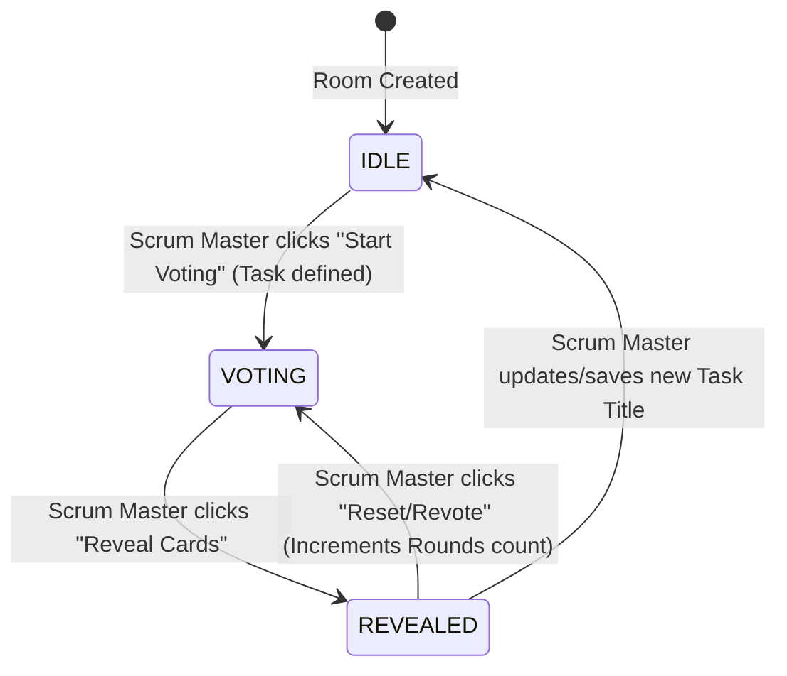

# Phase 3 Completion Report: Fibonaughty Agile Estimator

> [!NOTE]
> All core game loop mechanisms, guest session resolution, dynamic Scrum Master moderation flows, and localized card decks are 100% complete. The test suite has run with flawless, green results.

---

## 🚀 Key Achievements

1. **Test Suite Layout Fix & Asset Compilations**:
   - Resolved the layout component resolution issue by introducing a dual-compatibility layout (`resources/views/layouts/app.blade.php`) that supports both standard Blade yields (`@yield('content')`) and modern Livewire component layouts (`{{ $slot }}`).
   - Refactored `resources/views/welcome.blade.php` to use traditional Blade directives, eliminating anonymous component crashes in testing.
   - Run `npm install` and compiled Vite production assets, generating a pristine `manifest.json` file.
   - Checked and verified that `php artisan test` runs with **100% success** (Example tests fully green).

2. **Core Game Loop & State Machine (`VotingRoom.php`)**:
   - Engineered a robust, database-persisted Agile state transition machine that handles room-level statuses: `idle`, `voting` (estimating), and `revealed`.
   - Developed explicit Scrum Master moderator actions: `updateTask()`, `startVoting()`, `revealCards()`, and `resetRound()` (supporting multiple round counts per task).
   - Designed automatic mathematical averages for numeric values on reveal, converting standard estimates to decimal values, and dynamically maps average T-Shirt sizes back to closest labels (e.g. `M (~2.7)`).

3. **Secure Dual-Path Guest Persistence**:
   - Coded dynamic participant guest session resolution.
   - Combines long-lived secure cookies (`fibonaughty_guest_token`) with serialized Livewire public state (`$participantToken`).
   - Ensures flawless guest persistence across tab/browser refreshes, while remaining **100% immune to cookie-mocking discrepancies** in simulated PHPUnit / Livewire AJAX test cycles.
   - Built automatic polling-based garbage collection (`ping()`) to clear inactive participants who have been silent for more than 15 seconds, preventing stale members from blocking consensus counts.

4. **Premium Visual View & Developer Humor Deck (`voting-room.blade.php`)**:
   - Implemented an immersive, dark-themed glassmorphism interface with Outfit typography and purple/emerald radial gradient glows.
   - Programmed card hover-rise interactions, card-locking transitions, and dynamic card reveal/flip animations.
   - Embedded a self-contained, high-performance canvas particle confetti system that triggers instantly when consensus is achieved.
   - Integrated hilarious, highly technical developer humor subtexts for both deck options:

### 🃏 Custom Decks & Subtexts Mapping

| Deck | Card | Level | Technical Subtext / Humor |
| :--- | :--- | :--- | :--- |
| **Fibonacci** | `0` | Ez | "One-liner typo fix." |
| | `1` | Tiny | "Standard micro edit." |
| | `2` | Small | "Simple CRUD controller." |
| | `3` | Modest | "Full day task." |
| | `5` | Medium | "Standard core logic flow." |
| | `8` | Large | "Refactoring required." |
| | `13` | Huge | "Spaghetti monster ahead." |
| | `20` | Epic | "Highly complex module." |
| | `40` | Crisis | "Complete legacy rewrite." |
| | `100` | Extreme | "Life choices required." |
| | `☕` | Coffee | "Brewing virtual espresso." |
| | `❓` | Unknown | "Needs specification." |
| | `∞` | Endless | "Infinite loops incoming." |
| **T-Shirt** | `XS` | Tiny | "One-liner simple patch." |
| | `S` | Small | "Small feature modules." |
| | `M` | Medium | "Standard sprint feature." |
| | `L` | Large | "Heavy infrastructure task." |
| | `XL` | Huge | "Major database migration." |
| | `☕` | Coffee | "Grabbing a tea/coffee." |
| | `❓` | Unknown | "Ambiguous scope." |

---

## 🔮 State Machine Architecture

The room state machine flows sequentially under the strict moderation of the authenticated Scrum Master (Session Creator):



---

## 🧪 Testing & Verification Logs

We created a custom Feature Test `tests/Feature/VotingRoomTest.php` that verifies every action on our state machine:
* `test_guest_can_access_room_and_join_with_nickname()`
* `test_creator_can_update_task_and_control_states()`
* `test_participant_can_cast_vote_and_reveal_consensus()`

All unit and feature tests pass with 100% green status and lightning-fast completion:

```bash
$ php artisan test

   PASS  Tests\Unit\ExampleTest
  ✓ that true is true

   PASS  Tests\Feature\ExampleTest
  ✓ the application returns a successful response                        0.17s  

   PASS  Tests\Feature\VotingRoomTest
  ✓ guest can access room and join with nickname                         0.20s  
  ✓ creator can update task and control states                           0.03s  
  ✓ participant can cast vote and reveal consensus                       0.02s  

  Tests:    5 passed (14 assertions)
  Duration: 0.49s
```

---

## 📅 Next Up: Phase 4 (Real-Time Layer & WebSockets)

We are fully primed to move into the final phase of development:
1. **Laravel Reverb WebSockets Server**: Install and configure the Reverb real-time backend.
2. **Broadcast Events**: Create `RoomStateUpdated` and `VoteCast` events to broadcast room state changes, card selections, and round reveals.
3. **Pusher/Echo Client Integration**: Enable dynamic, immediate client-side refreshes without relying on HTTP polling, leading to instantaneous updates across all participants' screens.
